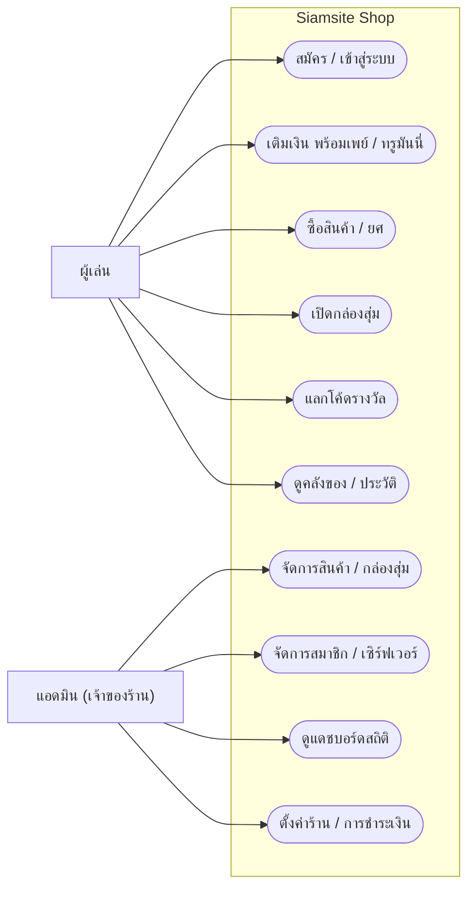
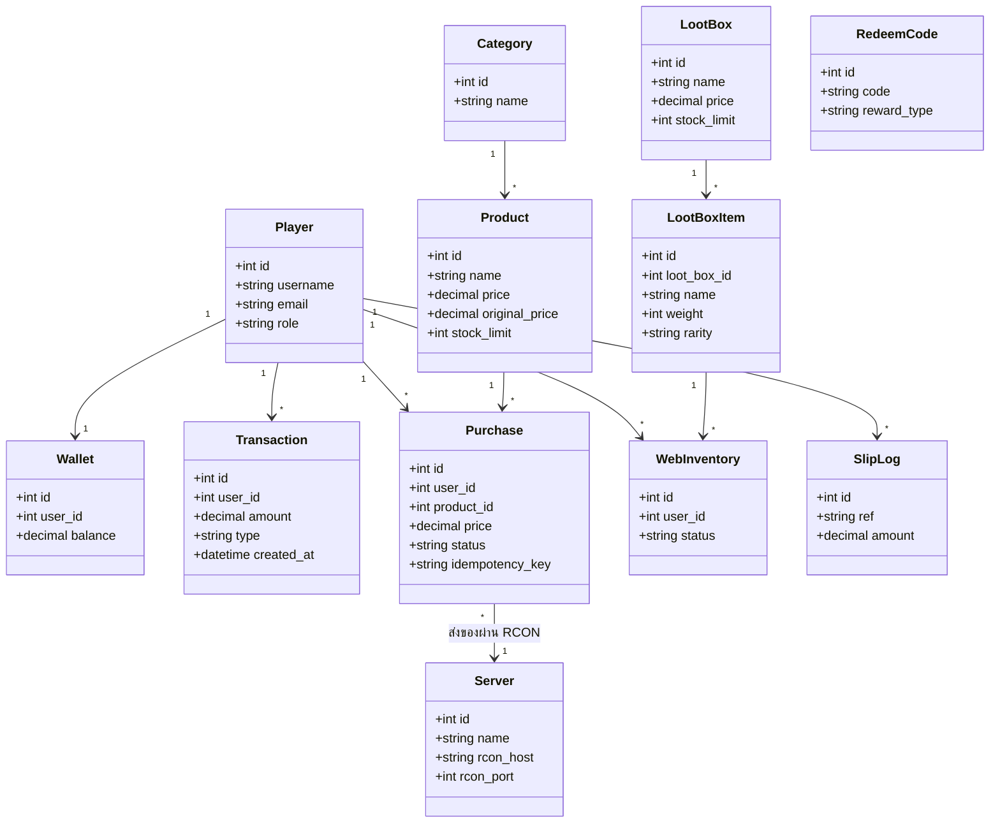
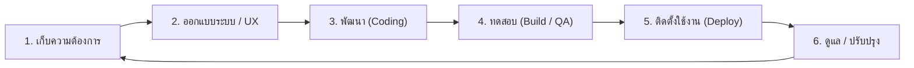

# Siamsite Shop

**ระบบร้านค้าออนไลน์สำเร็จรูปสำหรับเซิร์ฟเวอร์ Minecraft**
ให้ผู้เล่นเติมเงินและซื้อของในเว็บ แล้วของเข้าเกมทันทีแบบอัตโนมัติ 24 ชั่วโมง

---

## Siamsite Shop คืออะไร

Siamsite Shop คือเว็บร้านค้าสำหรับเจ้าของเซิร์ฟเวอร์ Minecraft ที่อยากเปิดขายไอเท็ม ยศ และสิทธิพิเศษให้ผู้เล่นแบบมืออาชีพ

ผู้เล่นแค่เข้าเว็บ ล็อกอินด้วยชื่อในเกมเดิม เติมเงินผ่านพร้อมเพย์หรือทรูมันนี่ แล้วกดซื้อ ระบบจะส่งของเข้าเกมให้เองทันที เจ้าของร้านไม่ต้องนั่งเฝ้าเติมของให้ทีละคน ทุกอย่างทำงานอัตโนมัติตลอดเวลา แม้เจ้าของจะออฟไลน์อยู่ก็ตาม

พูดง่าย ๆ คือ **เปลี่ยนเซิร์ฟเวอร์ของคุณให้มีหน้าร้านออนไลน์ที่ขายของได้เองตลอด 24 ชั่วโมง**

---

## FEATURE (ความสามารถ)

### สำหรับผู้เล่น (ลูกค้าของร้าน)

- **เติมเงินง่าย** รองรับพร้อมเพย์ (สแกน QR) และซองอั่งเปาทรูมันนี่ เงินเข้ากระเป๋าอัตโนมัติ
- **ซื้อแล้วได้ของทันที** ไอเท็ม ยศ หรือสิทธิ์ต่าง ๆ เข้าเกมทันทีที่กดซื้อ (ผู้เล่นต้องออนไลน์อยู่ในเกม)
- **กล่องสุ่ม (Loot Box)** ลุ้นของรางวัลตามระดับความหายาก พร้อมเอฟเฟกต์เปิดกล่องสนุก ๆ
- **โค้ดแลกรับ** ใส่โค้ดเพื่อรับเงินหรือไอเท็มจากกิจกรรมและโปรโมชัน
- **ดูประวัติ** เช็กยอดเงิน รายการซื้อ และของในคลังของตัวเองได้ตลอด
- **จัดอันดับผู้เติมเงิน** โชว์อันดับผู้สนับสนุน สร้างสีสันและการมีส่วนร่วม

### สำหรับเจ้าของร้าน (แอดมิน)

- **แดชบอร์ดสรุปยอด** ดูยอดขาย ยอดเติมเงิน และจำนวนผู้เล่นออนไลน์แบบเรียลไทม์
- **จัดการสินค้าเอง** เพิ่ม/แก้/ลบสินค้า ตั้งราคา ลดราคา จำกัดสต็อก หรือตั้งเวลาโปรได้
- **รองรับหลายเซิร์ฟเวอร์** เชื่อมได้หลายเซิร์ฟในร้านเดียว
- **จัดการกล่องสุ่มและโค้ด** ตั้งของรางวัล อัตราการออก และแจกโค้ดโปรโมชันได้เอง
- **ดูแลสมาชิก** ดูข้อมูลผู้เล่น ประวัติการซื้อ และปรับยอดเงินได้
- **ปรับแต่งหน้าร้าน** ตั้งชื่อร้าน โลโก้ แบนเนอร์ ธีมสี และข้อความประกาศได้ตามใจ

### จุดเด่น

- ทำงานอัตโนมัติ 100% ตั้งค่าครั้งเดียว รับเงินและส่งของเองตลอด 24 ชั่วโมง
- ใช้บัญชีเดิมของผู้เล่น ล็อกอินด้วยชื่อและรหัสในเกมที่มีอยู่แล้ว
- ปลอดภัยเรื่องเงิน ตรวจสลิปอัตโนมัติ กันการโกงและการใช้สลิปซ้ำ
- รองรับมือถือเต็มรูปแบบ สวยและใช้ง่ายทั้งบนคอมและมือถือ

---

## TECHSTACK (เทคโนโลยีที่ใช้)

| ส่วน | เทคโนโลยี |
|------|-----------|
| Frontend | Next.js 14 (App Router), React, TailwindCSS, Framer Motion |
| Backend | Node.js, Express, TypeScript |
| ฐานข้อมูล | MySQL 8 |
| แคช / เรียลไทม์ | Redis 7, Socket.IO |
| ยืนยันตัวตน | JWT + AuthMe (bcrypt) |
| ชำระเงิน | พร้อมเพย์ QR, ทรูมันนี่, EasySlip (ตรวจสลิปอัตโนมัติ) |
| ส่งของเข้าเกม | RCON (connection pool ต่อเซิร์ฟเวอร์) |
| Deploy | Docker, Docker Compose, Nginx Proxy Manager |

---

## System Architecture (ภาพรวมสถาปัตยกรรม)

```mermaid
flowchart TD
    subgraph ผู้ใช้งาน
      B["เบราว์เซอร์ผู้เล่น / มือถือ"]
    end
    subgraph หน้าเว็บ
      FE["Frontend: Next.js 14 + Tailwind"]
    end
    subgraph เซิร์ฟเวอร์ระบบ
      BE["Backend API: Express + TypeScript"]
      WS["Socket.IO (เรียลไทม์)"]
    end
    subgraph เก็บข้อมูล
      DB[("MySQL 8")]
      RD[("Redis 7")]
    end
    subgraph ภายนอก
      PAY["พร้อมเพย์ / ทรูมันนี่ / EasySlip"]
      MC["เซิร์ฟเวอร์ Minecraft"]
    end

    B --> FE --> BE
    B <-.->|จำนวนคนออนไลน์| WS
    WS --- BE
    BE --> DB
    BE --> RD
    BE -->|ตรวจการชำระเงิน| PAY
    BE -->|ส่งของผ่าน RCON| MC
```

---

## Use Case Diagram (แผนภาพการใช้งาน)



---

## Class Diagram (โครงสร้างข้อมูลหลัก)



---

## SDLC (ขั้นตอนการพัฒนา)

โครงการพัฒนาแบบเป็นรอบ (Iterative) เพื่อให้ปรับปรุงและส่งมอบฟีเจอร์ได้ต่อเนื่อง



1. **เก็บความต้องการ** รวบรวมสิ่งที่เจ้าของร้านและผู้เล่นต้องการ กำหนดขอบเขตงาน
2. **ออกแบบระบบ / UX** วางสถาปัตยกรรม ฐานข้อมูล และหน้าตาการใช้งานให้เข้าใจง่าย
3. **พัฒนา** เขียนโค้ดตามดีไซน์ที่ตกลง แยกส่วน Frontend / Backend ชัดเจน
4. **ทดสอบ** ตรวจ build ให้ผ่าน ทดสอบการทำงานจริงก่อนปล่อย
5. **ติดตั้งใช้งาน** deploy ด้วย Docker ทีละร้านแบบควบคุมได้
6. **ดูแล / ปรับปรุง** ติดตามผล แก้ปัญหา และพัฒนาฟีเจอร์เพิ่มตามความเห็นผู้ใช้

---

## ติดต่อเรา

สนใจเปิดใช้งาน หรืออยากดูตัวอย่างระบบจริง ทักมาได้เลย

- Facebook Fanpage: [Siamsite Store](https://www.facebook.com/siamsitestore/)
- Facebook (ส่วนตัว): [First Ngub](https://www.facebook.com/firstngub/)

---

© 2026 Siamsite Shop (SiamWorld). สงวนลิขสิทธิ์ทุกประการ / All Rights Reserved.

ซอฟต์แวร์นี้เป็นทรัพย์สินและลิขสิทธิ์ของเจ้าของโครงการ ห้ามคัดลอก ดัดแปลง เผยแพร่ หรือนำไปใช้เชิงพาณิชย์โดยไม่ได้รับอนุญาตเป็นลายลักษณ์อักษร ดูรายละเอียดใน [LICENSE](LICENSE)
